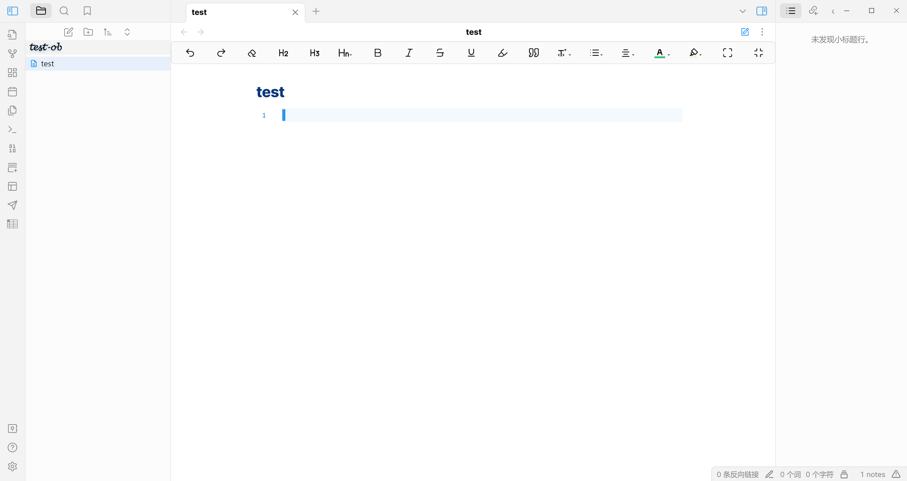

# Obsidian config template

[](https://github.com/Bit-Part-Young/obsidian-config/actions/workflows/mkdocs-deploy.yml)

Obsidian 软件配置模板。

- **Repo**: [https://github.com/Bit-Part-Young/obsidian-config](https://github.com/Bit-Part-Young/obsidian-config)
- **Full Documentation**: [README.md](https://github.com/Bit-Part-Young/obsidian-config) / [obsidian-config Documentation](https://seekanotherland.xyz/obsidian-config/)

---

外观效果图：


<!--  -->

---

自定义快捷键：

| 功能 | 快捷键 |
| :--: | :--: |
| 打开 Vault | `Ctrl + Alt + O` |
| 插入水平线 | `Ctrl + Alt + H` |
| 插入代码块 | `Ctrl + Alt + K` |
| 切换实时阅览/源码模式 | `Ctrl + Alt + S` |

---

## 目录结构

```txt
.
├── .gitignore
├── .obsidian/
└── .obsidian.vimrc
```

- `.obsidian/` - Obsidian 主题、核心及社区插件、快捷键等设置
- `.obsidian.vimrc` - Obsidian vim 插件的 .vimrc 配置文件
- `.gitignore` - 忽略文件

---

已安装插件：

```txt
plugins
├── editing-toolbar/  # 在文档最上方添加类 Office 工具栏
├── emoji-shortcodes/  # markdown emoji 表情
├── obsidian-admonition/  # obsidian alert 语法插件 
├── obsidian-auto-link-title/  # 自动获取 URL 标题
├── obsidian-enhancing-export/  # 文件格式导出增强
├── obsidian-git/  # git 插件
├── obsidian-image-auto-upload-plugin/  # 借助 picgo 实现图片自动上传
├── obsidian-linter/  # 文档格式化
├── obsidian-vault-statistics-plugin/  # 统计 obsidian vault 相关信息
├── obsidian-vimrc-support/  # vim 插件
├── remember-cursor-position/  # 记录光标位置
├── remotely-save/  # 数据同步服务
├── floating-toc/  # 目录浮动体
└── table-editor-obsidian/  # markdown 表格增强
```

相关插件介绍可点击查看： [Obsidian 使用](https://seekanotherland.xyz/hexo-demo/posts/4661.html)。

---

## 使用

- **git 初始化你的 Obsidian vault**

```bash
cd obsidian-vault/

git init
```

- 按照以下步骤拷贝配置文件

```bash
git clone https://github.com/Bit-Part-Young/obsidian-config.git
# or
git clone https://gitee.com/yangsl306/obsidian-config.git

cd obsidian-config

cp -r .obsidian/ .obsidian.vimrc .gitignore Makefile obsidian-vault/
```

- 信任仓库作者并启用插件

>对于 PC - 手机端同步（**使用场景：手机端个人主要随时记录想法或看到的一些有用链接，仅这些内容需要同步，不需要太多的插件**），可以开启 Remotely Save 插件，选择性开启其他插件（如 Git 插件可关闭）。

---

## 忽略文件

可忽略的配置文件或目录

```bash
.obsidian/workspace.json
.obsidian/plugins/remember-cursor-position/cursor-positions.json
```
